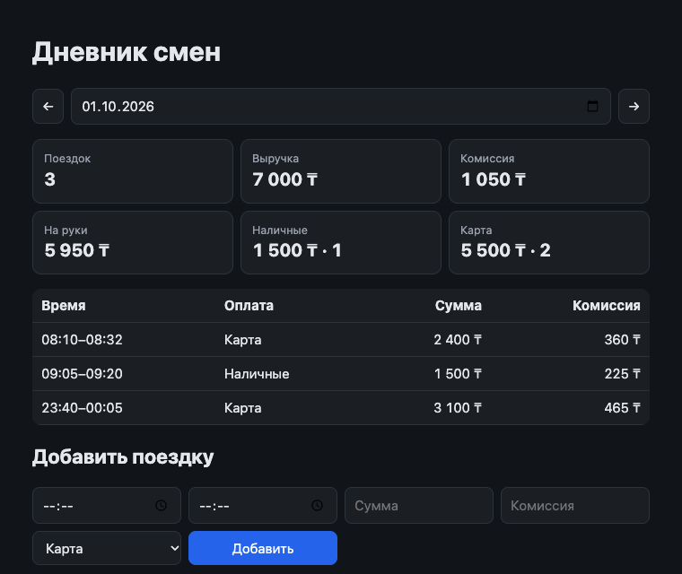

# Дневник смен водителя

[](https://github.com/zhandos717/driver-shift-diary/actions/workflows/test.yml)


Сервер на Node.js и веб-клиент: сводка за день, список поездок, переключение дней, добавление поездки с проверкой данных и защитой от дублей. Внешних зависимостей нет — только стандартная библиотека Node.



## Быстрый старт

Нужен Node.js 20+.

```bash
git clone https://github.com/zhandos717/driver-shift-diary.git
cd driver-shift-diary
npm start     # http://localhost:3000
npm test
```

`npm install` не нужен. Переменные окружения: `PORT` (по умолчанию `3000`), `TRIPS_FILE` (по умолчанию `data/trips.json`).

## Что сделано

| Требование | Где |
|---|---|
| API: поездки за день и сводка (количество, выручка, комиссия, на руки, наличные/карта) | `GET /api/trips?date=` — [src/server.js](src/server.js), [src/trips.js](src/trips.js) |
| Клиент: сводка, список, переключение дней | [public/index.html](public/index.html) |
| Добавление с проверкой данных и без дублей | `POST /api/trips` |
| Тесты сводки и защиты от дублей | [test/trips.test.js](test/trips.test.js) |

## API

### `GET /api/trips?date=YYYY-MM-DD`

```json
{
  "date": "2026-10-01",
  "summary": {
    "count": 3, "revenue": 7000, "commission": 1050, "net": 5950,
    "cash": { "count": 1, "amount": 1500 },
    "card": { "count": 2, "amount": 5500 }
  },
  "trips": [ { "id": "t1", "start": "2026-10-01T08:10:00+05:00", "end": "2026-10-01T08:32:00+05:00", "amount": 2400, "payment": "card", "commission": 360 } ]
}
```

`net` («на руки») = выручка − комиссия.

### `GET /api/days`

Дни, в которых есть поездки, — клиент открывает последний из них.

### `POST /api/trips`

```bash
curl -X POST localhost:3000/api/trips \
  -d '{"id":"t9","start":"2026-10-01T12:00:00+05:00","end":"2026-10-01T12:20:00+05:00","amount":2000,"payment":"cash","commission":300}'
```

| Код | Когда |
|---|---|
| `201` | поездка создана |
| `200` + `"duplicate": true` | такая поездка уже есть — ничего не изменилось |
| `409` | тот же `id`, но другие данные — существующая запись не перезаписывается |
| `422` | ошибки проверки, список в `errors` |
| `400` | некорректный JSON или дата |

## Принятые решения

- **К какому дню относится поездка.** По местной дате начала из `start`, а не по UTC. Иначе поездка в 01:30 по +05:00 оказалась бы в предыдущем дне. Поездка через полночь относится к дню, в который началась.
- **Проверки:** `amount` — целое > 0; `end` позже `start`; даты в ISO 8601 обязательно со смещением; `payment` — `cash` или `card`; `0 ≤ commission ≤ amount`. Суммы целые (тенге) — без ошибок округления float.
- **Дубли.** `id` поездки служит ключом идемпотентности. Время сравнивается как момент, а не как строка: `08:10+05:00` и `03:10Z` — одна и та же поездка.
- **Клиент** создаёт `id` один раз на заполненную форму, поэтому двойной клик или повтор после обрыва сети не создадут дубль.
- **Хранение** — JSON-файл, запись атомарная (временный файл + `rename`). Для одного водителя этого достаточно; при нескольких экземплярах сервера понадобится БД с уникальным ключом по `id`.

## Структура

```
src/trips.js        проверка, сводка, хранилище с защитой от дублей
src/server.js       HTTP API и отдача клиента
public/index.html   клиент
test/trips.test.js  тесты (node:test)
data/trips.json     данные
```

## Как использовался ИИ

Код, тесты и README написаны с помощью Claude; я ставил задачу, проверял решения и правил результат.

Где ИИ ошибся:
- В тесте на конфликт по `id` подставил `amount: 1` при комиссии 360. Сервер правильно отклонял такую поездку с 422 вместо ожидаемого 409 — исправлен тест, а не код.
- В первой версии клиента шесть карточек сводки раскладывались как 5 + 1; заметил по скриншоту и перевёл на сетку 3 × 2.

## Лицензия

[MIT](LICENSE)
