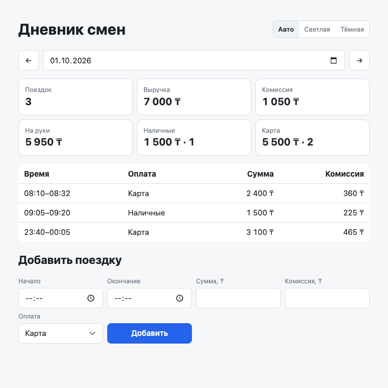
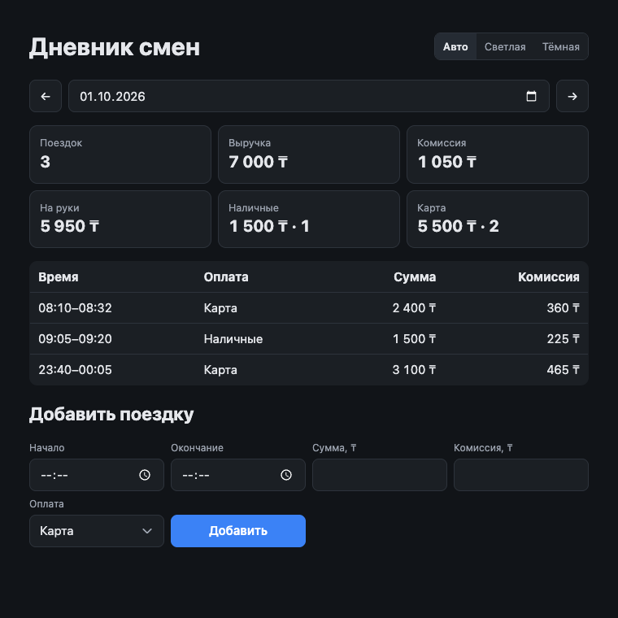
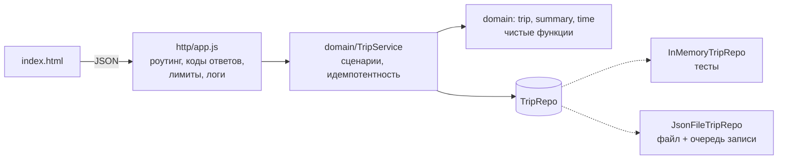

# Дневник смен водителя

[](https://github.com/zhandos717/driver-shift-diary/actions/workflows/test.yml)


Сервер на Node.js и веб-клиент: сводка за день, список поездок, переключение дней, добавление поездки с проверкой данных и защитой от дублей. Внешних зависимостей нет — только стандартная библиотека Node.

| Светлая тема | Тёмная тема |
|---|---|
|  |  |

## Быстрый старт

Нужен Node.js 20+. `npm install` не нужен.

```bash
git clone https://github.com/zhandos717/driver-shift-diary.git
cd driver-shift-diary
npm start               # http://localhost:3000
npm test                # 26 тестов
npm run test:coverage
```

| Переменная | По умолчанию | Назначение |
|---|---|---|
| `PORT` | `3000` | порт HTTP |
| `TRIPS_FILE` | `data/trips.json` | файл с поездками |
| `DRIVER_OFFSET` | `+05:00` | часовой пояс водителя, по нему определяется день поездки |
| `MAX_BODY_BYTES` | `16384` | лимит тела запроса |

Конфиг проверяется при старте; битый или некорректный файл данных останавливает запуск с понятной ошибкой, а не роняет запросы потом.

## Что сделано

| Требование | Где |
|---|---|
| API: поездки за день и сводка | `GET /api/trips?date=` → [trip-service.js](src/domain/trip-service.js), [summary.js](src/domain/summary.js) |
| Клиент: сводка, список, переключение дней | [public/index.html](public/index.html) |
| Добавление с проверкой данных | `POST /api/trips` → [trip.js](src/domain/trip.js) |
| Повтор не создаёт дубль | [trip-service.js](src/domain/trip-service.js), [memory-repo.js](src/storage/memory-repo.js) |
| Тесты сводки и защиты от дублей | [test/](test) |

## Архитектура



```
src/
  domain/        бизнес-правила, без I/O
    time.js        строгий разбор ISO 8601, перевод в пояс водителя
    trip.js        валидация и нормализация поездки
    summary.js     расчёт сводки
    trip-service.js сценарии: отчёт за день, добавление
  storage/       реализации репозитория
  http/          транспорт: роутер, чтение тела, ошибки
  config.js      конфиг из env с проверкой
  server.js      точка сборки, graceful shutdown
```

Зависимости направлены внутрь: домен не знает про HTTP и файлы. Поэтому доменные тесты идут на in-memory репозитории без сети и диска, а замена файла на БД затрагивает только `storage/`.

## API

### `GET /api/trips?date=YYYY-MM-DD`

```json
{
  "date": "2026-10-01",
  "summary": {
    "count": 3, "revenue": 7000, "commission": 1050, "net": 5950,
    "cash": { "count": 1, "amount": 1500 },
    "card": { "count": 2, "amount": 5500 }
  },
  "trips": [{ "id": "t1", "start": "2026-10-01T08:10:00+05:00", "end": "2026-10-01T08:32:00+05:00", "amount": 2400, "payment": "card", "commission": 360 }]
}
```

`net` («на руки») = выручка − комиссия.

### `POST /api/trips`

```bash
curl -X POST localhost:3000/api/trips -H 'Content-Type: application/json' \
  -d '{"id":"t9","start":"2026-10-01T12:00:00+05:00","end":"2026-10-01T12:20:00+05:00","amount":2000,"payment":"cash","commission":300}'
```

| Код | Когда |
|---|---|
| `201` | поездка создана |
| `200` + `"duplicate": true` | такая поездка уже есть, ничего не изменилось |
| `409` | тот же `id`, но другие данные; в ответе — сохранённая версия |
| `422` | ошибки проверки, список в `errors` |
| `400` / `413` / `415` | некорректный JSON или дата / тело больше лимита / не `application/json` |

### Служебные

- `GET /api/days` — дни, где есть поездки, и часовой пояс водителя.
- `GET /healthz` — проверка живости для балансировщика или оркестратора.

## Ключевые решения

**Время.** `Date.parse` молча превращает 31 февраля в 3 марта и принимает `24:00`, поэтому даты разбираются вручную со строгой проверкой календаря. Смещение обязательно. На входе время переводится в пояс водителя (`DRIVER_OFFSET`) и хранится уже нормализованным: день поездки и время на экране не зависят от того, в каком поясе их прислал клиент. Поездка через полночь относится к дню, в который началась. Длительность — не больше 24 часов.

**Идемпотентность.** `id` поездки — ключ идемпотентности, а проверка и вставка выполняются одной атомарной операцией репозитория `insertIfAbsent` (в SQL это `INSERT … ON CONFLICT DO NOTHING`). Повтор с теми же данными → `200`. Тот же `id` с другими данными → `409` без перезаписи: молча обновлять финансовую запись по повторному запросу опасно. Сравнение идёт после нормализации, поэтому `08:10+05:00` и `03:10Z` — одна поездка.

**Клиент** вычисляет `id` как SHA-256 от содержимого поездки. Ретрай после обрыва сети, двойной клик, правка поля туда и обратно — всё даёт тот же `id`, дубль не появляется. Светлая и тёмная темы: по умолчанию следует системе, выбор запоминается. Кнопка блокируется на время запроса, ответы за устаревший день отбрасываются, данные выводятся через `textContent`, без `innerHTML`.

**Деньги** — целые тенге (`Number.isSafeInteger`, верхний предел 10 млн): без ошибок float и переполнения.

**Хранение.** JSON-файл — снимок, читается в память при старте и проверяется. Записи идут через очередь промисов (параллельные запросы не перетирают файл), атомарно: временный файл → `fsync` → `rename`. Если запись не удалась, вставка в памяти откатывается и клиент получает `500` — состояние в памяти и на диске не расходится.

**Эксплуатация.** Структурированные JSON-логи на каждый запрос (метод, путь, статус, время), `SIGTERM`/`SIGINT` — дождаться текущих запросов и записи на диск, лимит тела, `405` с заголовком `Allow`.

## Ограничения и что дальше

Осознанно оставлено простым для объёма задания:

- **Один процесс, один водитель.** Файловое хранилище не годится для нескольких экземпляров. Следующий шаг — PostgreSQL: `trips(id PK, driver_id, start_at timestamptz, …)`, индекс `(driver_id, start_at)`, сводка — `GROUP BY` на стороне БД. Контракт репозитория уже под это.
- **Нет аутентификации.** Для продакшена — токен водителя, и `id` становится уникальным в рамках водителя.
- **Сводка считается на лету.** Для дня это десятки строк, кэш не нужен.
- **Часовой пояс — фиксированное смещение.** В Казахстане нет перехода на летнее время, так что этого достаточно; для других стран — IANA-зона (`Asia/Almaty`) через `Intl`.
- **Клиент без сборки и фреймворка** — одна страница; при росте логично перейти на TypeScript и вынести клиент в отдельный пакет.

## Тесты

`test/domain.test.js` — сводка, строгий разбор дат, валидация, группировка по дням, идемпотентность (в том числе 10 параллельных отправок одной поездки).
`test/storage.test.js` — загрузка и проверка файла, сохранение между перезапусками, откат при ошибке записи.
`test/http.test.js` — контракт API: все коды ответов, лимиты, роутинг, конфиг.

Покрытие строк — 99%.

## Как использовался ИИ

Код, тесты и README написаны с помощью Claude; я ставил задачу, принимал решения и проверял результат. Отдельно прогнал независимое ревью вторым агентом, а потом проверил всё в браузере.

Где ИИ ошибся или недоработал, и что исправлено:
- **Первая версия проверяла даты регуляркой и `Date.parse`** — 31 февраля проходило проверку и сохранялось. Заменено строгим разбором.
- **День поездки зависел от пояса, который прислал клиент**: та же поездка в UTC попадала во вчерашний день. Теперь время нормализуется к поясу водителя.
- **Защита от дублей на клиенте была дырявой**: случайный `id` сбрасывался при любой правке формы, и после потерянного ответа мог появиться дубль. Заменено на `id` из хеша содержимого.
- **Не было лимита на тело запроса** — 30 МБ читались в память целиком.
- **Начальные данные из файла не проверялись** — одна битая запись ломала сводку дня ошибкой 500.
- **В тесте конфликта ИИ подставил `amount: 1` при комиссии 360** и ждал 409, а сервер правильно отвечал 422. Исправлен тест, а не код.
- **Все слои были в одном файле.** Разделено на домен, хранилище и HTTP, чтобы правила тестировались без I/O и хранилище можно было заменить.

## Лицензия

[MIT](LICENSE)
